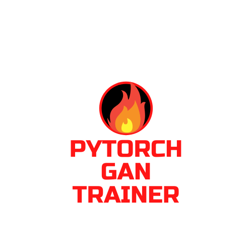

# Welcome to PyTorch GAN Trainer

**Quickly train a GAN to generate images!**

A simple module for you to directly import and start training different GAN models.
You can also log your runs with Weight and Biases.


### Aim

-   To create an easy inference to train/save/load different GAN models.
-   To learn how to create a Python package.
-   To learn unit testing with PyTest.
-   To learn how to create documentation with MkDocs.

### How to install?

Using pip, run the following command

```
pip install git+https://github.com/kad99kev/pytorch_gan_trainer.git
```

### How to use?

Please check the Colaboratory notebook to see different examples - [Example Notebook](https://colab.research.google.com/drive/1OD4tRnoZogv194X0SJDWt9Onct2nfcPx?usp=sharing)

You can also visit the documented example [here!](https://kad99kev.github.io/pytorch_gan_trainer/example/example.html)

### Contributing

-   If you find any bugs, feel free to raise an issue!
-   If you'd like to contribute by adding other GAN architectures, raise a pull request!

### Note

Since this project was mainly built as a learning experience, there might be few lingering bugs here and there. In that case, please raise an issue or submit a PR!

### License

This project is licensed under the MIT License.

### References

All packaging, testing and documentation referred from the tutorials on [calmcode.io](https://calmcode.io/)
