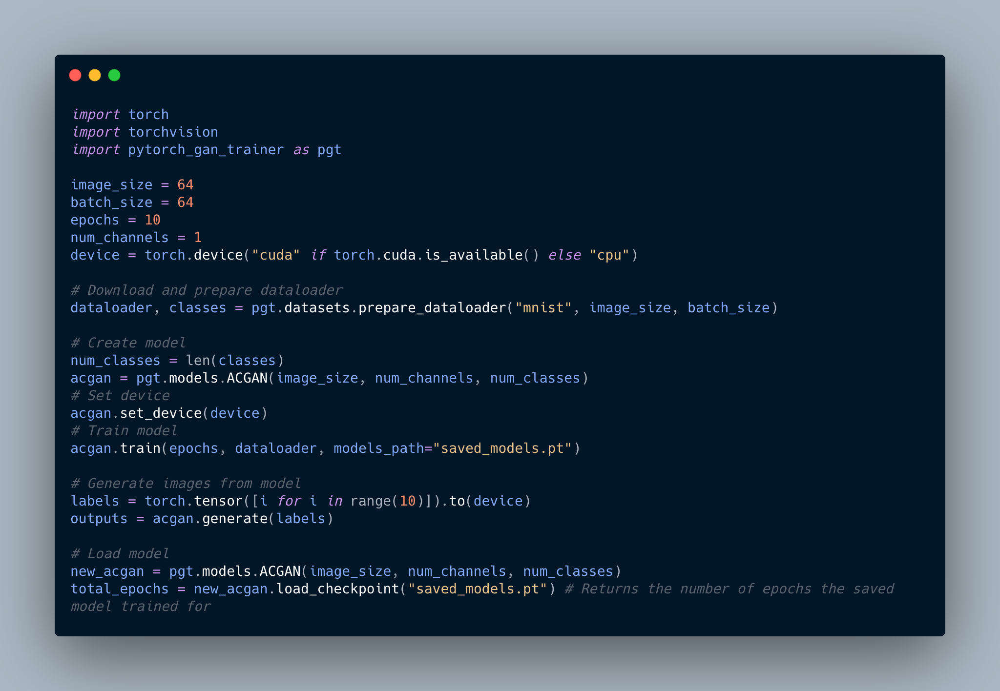

# PyTorch GAN Trainer

### Quickly train a GAN to generate images!

A simple module for you to directly import and start training different GAN models.
You can also log your runs with Weight and Biases.



### Aim

-   To create an easy inference to train/save/load different GAN models.
-   To learn about GANs.
-   To learn logging with Weights and Biases.

### How to install?

Clone this repository

```
git clone https://github.com/kad99kev/pytorch_gan_trainer.git
```

### How to use?

Please check the Colaboratory notebook to see different examples - [Examples Notebook](https://colab.research.google.com/drive/1OD4tRnoZogv194X0SJDWt9Onct2nfcPx?usp=sharing)

### Contributing

-   If you find any bugs, feel free to raise an issue!
-   If you'd like to contribute by adding other GAN architectures, raise a pull request!

### License

This project is licensed under the MIT License - see the [LICENSE.md](LICENSE.md) file for details.
